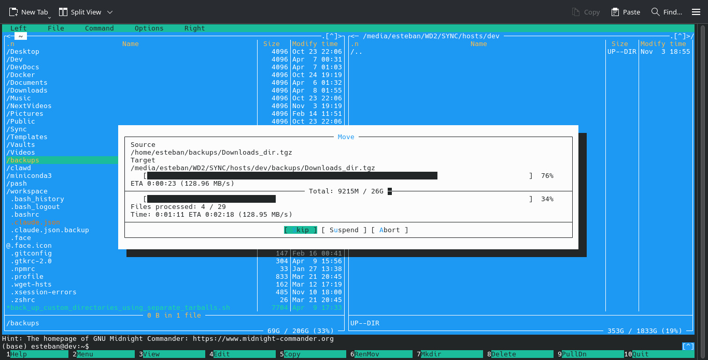

# back-up-and-restore-scripts

Scripts for backing up and restoring custom directories, files, media, containers, and databases efficiently.

  

## [back_up_and_restore_custom_directories_using_single_tarball](./back_up_and_restore_custom_directories_using_single_tarball/README.md)

Creates a single .tgz archive containing the specified directories and logs any errors encountered during the process.

Best suited for simple or smaller backup sets.

## [back_up_and_restore_custom_directories_using_separate_tarballs](./back_up_and_restore_custom_directories_using_separate_tarballs/README.md)

Creates individual .tgz archives for specified directories and logs any errors encountered during the process.

Ideal for handling large or complex backup sets that require separate, organized archives.

## [back_up_and_restore_custom_directories_with_zstd](./back_up_and_restore_custom_directories_with_zstd/README.md)

A comprehensive guide to creating, verifying, and restoring backups using Zstandard (zstd) for faster and more efficient compression. It covers command examples, integrity checks, error recovery, and advanced techniques like dictionary-based compression to improve speed and consistency in repeated backups.
